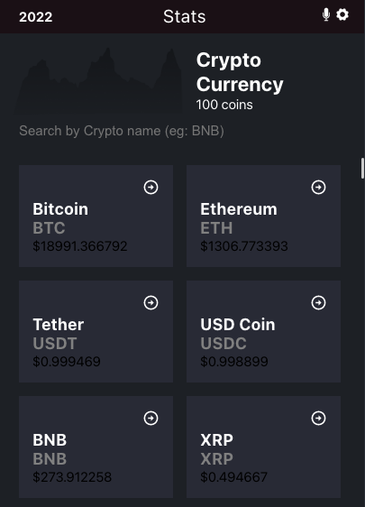

# digital-currency
“Digital Currency” is about working with the real live data from the Blockchain API. It’s a web application for a company that provides informations such as trending coins, coins’ price,and crypto transaction. The application allow users to get full information related to the crypto.

# 3rd api
https://api.coincap.io/v2/assets

# preview
